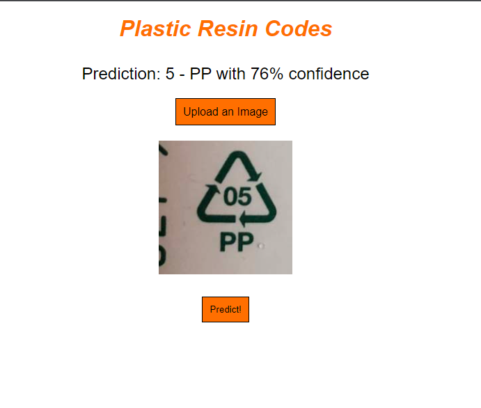

# Tensorflow Recycling

An app that will be able recognize the different recycling symbols and inform the user on what each one means.

### SS of app (still a work in progress)

## Installation instructions
If you would like to try it out on your local machine, please follow these instructions
1. fork and clone this repo
2. navigate to the directory you cloned the repo to and run `npm install` to install all the node dependencies
3. run `node app.js` then navigae to `localhost:8000` in your web browser and enjoy!
- feel free to ignore the python/pip dependencies as those were used for the creation of our model and are not necessary to run our app.

## Tech Used
- Python -- the main language we worked in for creating our model.
- Tensorflow and Keras -- High level APIs for machine learning. We used these to create, train, and save our model.
- Tensorflow.js for converting our python model into a js model for serving to a frontend client.
- Node and express -- For creating a simple backend to serve our model to frontend client that allows users to upload a photo and have our model make a prediction on it.

## User Stories
- As a user, I want to be able to upload an image of a recycling symbol.
- As a user, I want to be told which symbol I uploaded.
- As a user, I want to see more information about recycling based on the image I uploaded.

## Wireframes

## RESTful routing chart
| METHOD | ACTION | DESCRIPTION |
|--------|--------|-------------|
| GET | / | Landing page where users can upload photos for our model to make predictions on |
| GET | /model | For serving our model to the frontend client |

## Approach Taken
On the first day, after getting our project approved , we spent a lot of time doing research on Tensorflow and machine learning as both Jason and I were new to the subjects. We followed along with Tensorflow’s beginner guides on creating machine learning models and tried coding through their tutorials in order to better understand how to use this new technology.

After getting a decent grasp on how everything works, we started gathering data for our own dataset and using it to train our own model. I created a google drive folder for us to upload any images we found and luckily, Jason was able to find [a project](https://www.kaggle.com/datasets/piaoya/plastic-recycling-codes) that had a ton of images that were exactly what we were looking for. So we used the data we gathered and started on creating our own machine learning model.

Running tests on our model was rough as each test would take between 5 to 10 minutes depending on how our model was defined. It made determining what worked well and what didn’t a bit of a struggle as we would have to wait for each test to complete before we could compare the results. And after a ton of experimenting and testing, we ran into our first major roadblock. No matter what we tried, we were getting pretty bad accuracy with our model. The first issue which Jason thankfully discovered was that some of our data was being read improperly (images appearing as all black squares) so we went through and cleared any data we thought would cause an issue. But even after doing that, we still couldn’t break a validation accuracy of more than around 45%. We tried a number of different possible solutions such as introducing dropout, random data augmentation, and transfer learning from a base model but we didn’t see any improvement. After reaching out for some advice, we came to the conclusion that it would be near impossible to improve our accuracy without more and varied data. We decided that we would move on with what we had and used what we learned to craft a decent transfer learning model and trained it on our dataset.

From here we started to research and experiment with various ways to deploy and serve our model to a client. I started by trying to implement a web server and client while Jason tried experimenting on the mobile app side of things. At this point, most of the things I was working with were pretty comfortable to me. I was already familiar with JavaScript and Node and Express servers so thankfully getting one setup by following a guide was pretty simple.

## Unsolved problems
The app itself, as of now, is pretty bare. We only have users uploading a photo and getting our model to make a simple prediction on it. Unfortunately we ran out of time to really implement a solid user experience like we wanted but that is something that can easily be built upon in the future.

As for the accuracy of the model itself, It’s hard to say. More and more varied data would certainly help. Maybe with more than a day or two’s worth of research into machine learning and machine learning models would give us some insight on ways to improve our model’s accuracy as well.

## Pitch
### Group Members
Jason and Allen

1. How do you plan on learning/implementing this new technology?
    - We'll start by going through Tensorflow's website and reading through their various guides and try to follow along with some of their beginner tutorials.
2. What is your goal with this project?
    - To train a model that can reliably identify the different recycling symbols and use that model for an app that allows users to scan the symbols they find and inform them on what it means.
3. Who is the user for your app?
    - Anyone who wants to know more about how to recycle things.
4. Any potential roadblocks you think you might run into?
    - Learning how to use Tensorflow
    - Using a user's phone camera for image input
    
## Daily Sprints
